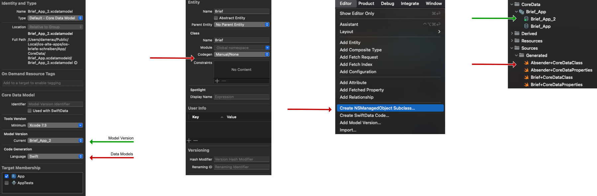

# iOS CoreDataKit

iOS CoreDataKit is a lightweight framework designed to simplify the management and utilization of CoreData in iOS applications. This README provides a brief overview and usage instructions for integrating CoreDataKit into your iOS project.



## Integration

To integrate CoreDataKit into your iOS project, follow these steps:

1. Add `CoreDataKit` to your project's dependencies.
2. Import `CoreDataKit` into your project files where CoreData functionality is required.

## Usage

**Note**: In the following examples, the model is named `Brief` and the database `Brief_App` such like at the screenshots.

### Setting up CoreData Stack

To set up the CoreData stack in your app, you can use the provided `CoreDataManager` class. Here's an example of how to set up the CoreData stack in your main app structure:

```swift
import CoreDataKit

@main
struct ExampleApp: App {

    // CoreData Stack
    let coreDataCloudStackManager: CoreDataManager = {
        let manager = CoreDataManager(bundle: Bundle.main,
                                      nameModel: "Brief_App")
        manager.iCloudSyncMode = .none
        return manager
    }()

    var body: some Scene {
        WindowGroup {
            ContentView()
                .environment(\.managedObjectContext, coreDataCloudStackManager.persistentContainer.viewContext)
        }
    }
}
```

### Example 1: Using CoreData in Views

You can use CoreData entities within your SwiftUI views by accessing the managed object context provided by the CoreData stack. Here's an example of how to fetch and display CoreData entities in a SwiftUI view:

```swift
import SwiftUI
import CoreDataKit

struct ContentView: View {

    @Environment(\.managedObjectContext) private var viewContext

    @FetchRequest(
        sortDescriptors: [NSSortDescriptor(keyPath: \Brief.lastname, ascending: true)],
        animation: .default
    )
    private var items: FetchedResults<Brief>

    var body: some View {
        NavigationView {
            List {
                ForEach(items) { item in
                    if let lastname = item.lastname {
                        NavigationLink {
                            Text("Item at \(lastname)")
                                .textStyle(.body)
                        } label: {
                            Text(lastname)
                        }
                    }
                }
                .onDelete(perform: deleteItems)
            }
            .toolbar {
                ToolbarItem(placement: .navigationBarTrailing) {
                    EditButton()
                }
                ToolbarItem {
                    Button(action: addItem) {
                        Label("Add Item", systemImage: "plus")
                    }
                }
            }
            Text("Select an item")
        }
    }

    private func addItem() {
        withAnimation {
            let newItem = Brief(context: viewContext)
            newItem.lastname = "Doe \(Date().ISO8601Format())"
            newItem.firstname = "John"

            do {
                try viewContext.save()
            } catch {
                let nsError = error as NSError
                fatalError("Unresolved error \(nsError), \(nsError.userInfo)")
            }
        }
    }

    private func deleteItems(offsets: IndexSet) {
        withAnimation {
            offsets.map { items[$0] }.forEach(viewContext.delete)

            do {
                try viewContext.save()
            } catch {
                let nsError = error as NSError
                fatalError("Unresolved error \(nsError), \(nsError.userInfo)")
            }
        }
    }
}
```

### Example 2: Using CoreData in Views

You can use CoreData entities within your SwiftUI views by accessing the managed object context provided by the CoreData stack. Here's an example of how to fetch and display CoreData entities in a SwiftUI view:

```swift
struct ContentView: View {
  
    @Environment(\.managedObjectContext) private var viewContext

    var body: some View {
        VStack {
           // Your content
        }
        .onAppear {
            let fetchRequest: NSFetchRequest<Brief> = Brief.fetchRequest()

            do {
                // Perform the fetch request
                let users = try viewContext.fetch(fetchRequest)

                // Process the fetched data
                for user in users {
                    // Access attributes or perform operations on each "users" object
                    print("CoreDataManager record: \(users.lastname ?? "<EMPTY>")")
                }
            } catch {
                // Handle fetch errors
                print("Failed to fetch users objects: \(error)")
            }
        }
    }
}
```

